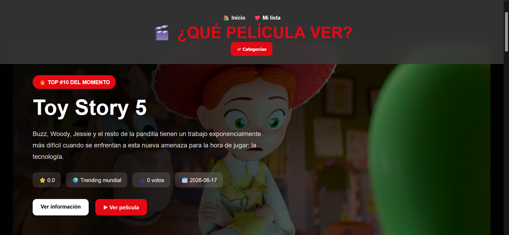
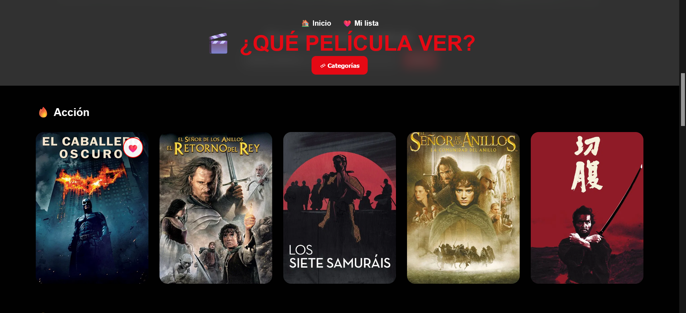
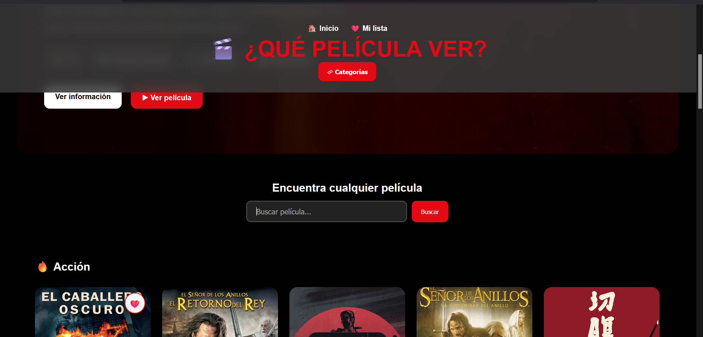
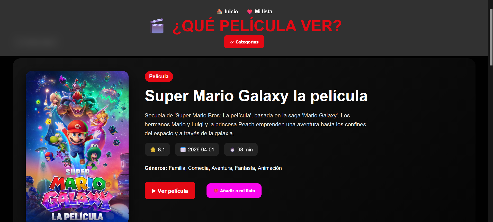
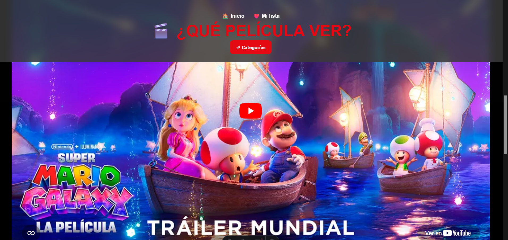
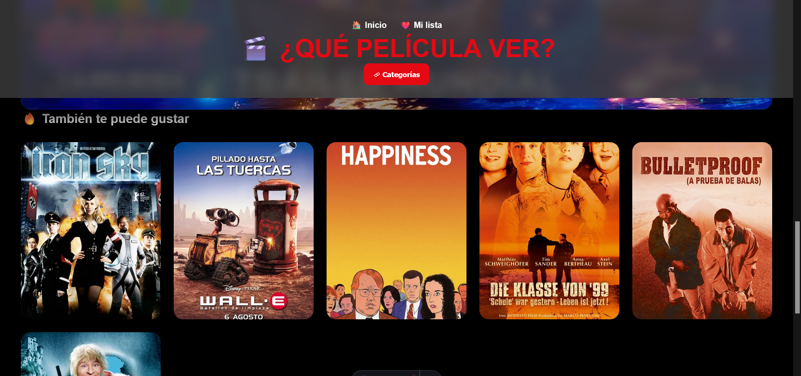
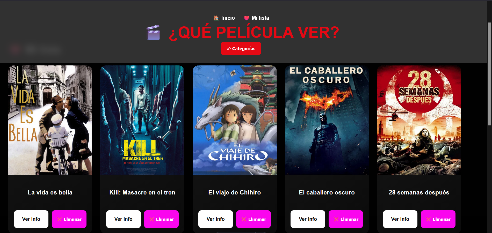
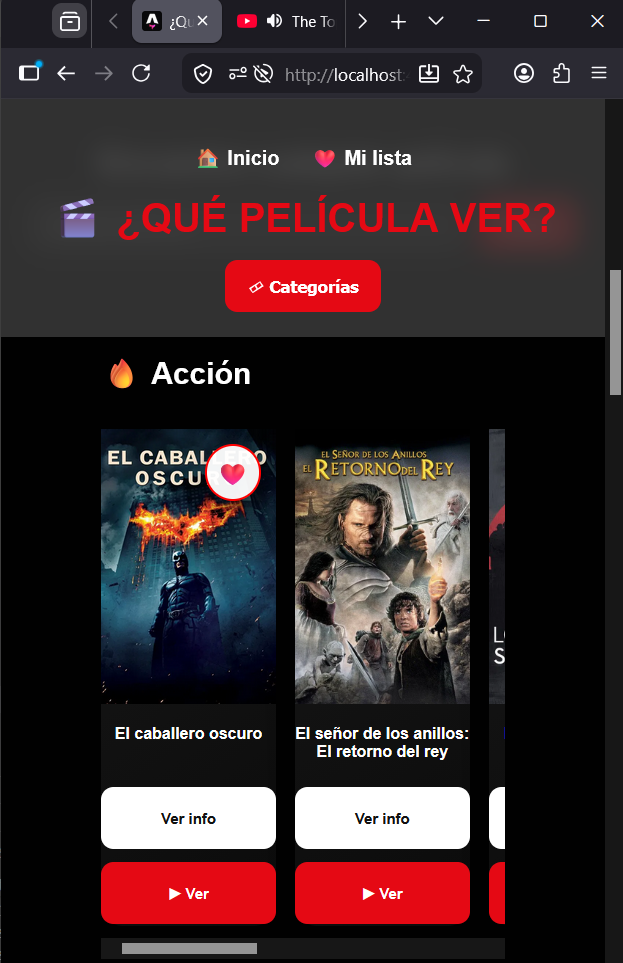

# 🎬 CineApp

Aplicación web inspirada en plataformas de streaming como Netflix, desarrollada con Astro y TypeScript.

!imagenes/Imagen_index.png

Permite descubrir películas populares, realizar búsquedas en tiempo real, consultar información detallada y gestionar una lista personal de favoritos almacenada localmente en el navegador.

---

## 🚀 Demo

🔗 **Aplicación online:**
[Añadir enlace del despliegue]


---

## 📸 Capturas

### Hero
El carrusel principal cambia automáticamente cada pocos segundos, destacando las películas más populares y recientes del catálogo.


---


### Categorías
Sistema de categorías que permite filtrar el catálogo de películas por género, facilitando la exploración de contenido según los intereses del usuario.


---


### Búsqueda de películas
Sistema de búsqueda por palabras clave que facilita encontrar películas relacionadas. El buscador incorpora validaciones para mejorar la experiencia de usuario, notificando de forma inmediata cuando se intenta realizar una búsqueda vacía.



Sistema de búsqueda en funcionamiento utilizando la palabra clave "Kill". La aplicación consulta la API de TMDB y muestra automáticamente las películas relacionadas con el término introducido por el usuario.
!imagenes/Imagen_index.png


---


### Información detallada
Las tarjetas en pantallas grandes tiene un sistema hover que permite dar mucha informacion de la pelicula solo poniendo el raton encima de la propia pelicula
!imagenes/Informacion_dinamica.png

Si el usuario accede a la ficha de una película, puede consultar información detallada, reproducir la película, añadirla a su lista de favoritos, visualizar el tráiler oficial y descubrir películas relacionadas que podrían resultar de su interés.

Información:


Trailer:


Recomendaciones:



### Mi Lista
El usuario puede crear una lista personalizada con sus películas favoritas. Además, mientras navega por la aplicación, podrá identificar fácilmente aquellas películas que ya ha guardado gracias al icono de corazón que aparece sobre ellas.



---


### Diseño Responsive
Toda la aplicación es completamente funcional en dispositivos móviles. Se ha desarrollado una versión responsive con un diseño minimalista y optimizado para pantallas táctiles, permitiendo al usuario acceder a todas las funcionalidades de la plataforma. Tanto el hero dinámico como el sistema de tarjetas, el buscador y la lista de favoritos mantienen su funcionamiento y accesibilidad en la versión móvil.



---

## ✨ Funcionalidades

* Consulta de películas populares.
* Búsqueda dinámica mediante API.
* Información detallada de cada película.
* Sistema de recomendaciones.
* Gestión de favoritos mediante LocalStorage.
* Diseño responsive para escritorio y móvil.
* Interfaz inspirada en plataformas de streaming modernas.
* Navegación entre categorías.

---

## 🛠️ Tecnologías utilizadas

### Frontend

* Astro
* TypeScript
* HTML5
* CSS3

### APIs

* TMDB (The Movie Database API)

### Herramientas

* Git
* GitHub
* Node.js
* npm

---

## 📂 Estructura del proyecto

```text
src/
│
├── components/
│   ├── CategoryCard.astro
│   ├── Footer.astro
│   ├── Header.astro
│   └── HomeMovieCard.astro
│
├── layouts/
│   └── MainLayout.astro
│
├── pages/
│   |   ├── categoria 
│   |   |     └── (genero).astro
│   |   └── pelicula
│   |       └── (id).astro    
│   | 
│   ├── index.astro
│   ├── busqueda.astro
│   └──favoritos.astro
│   
│
└── styles/
    └── global.css

```

## 🎯 Objetivos del proyecto

Este proyecto fue desarrollado con fines de aprendizaje y portfolio profesional para practicar:

* Consumo de APIs REST.
* Desarrollo con Astro.
* Componentización de interfaces.
* TypeScript tipado.
* Diseño responsive.
* Gestión de estado mediante LocalStorage.
* Buenas prácticas de organización de código.

---

## 📚 Aprendizajes obtenidos

Durante el desarrollo se trabajaron conceptos como:

* Reutilización de componentes.
* Refactorización de CSS.
* Uso de interfaces TypeScript.
* Gestión de errores y validaciones.
* Optimización responsive.
* Flujo de trabajo con Git y GitHub.
* Preparación de proyectos para despliegue.

---

## ⚠️ Aviso

Este proyecto utiliza datos proporcionados por la API de TMDB.
Las imágenes, títulos y descripciones pertenecen a sus respectivos propietarios.
Proyecto desarrollado únicamente con fines educativos y de portfolio.

---

## 👨‍💻 Autor

José Luis Escudero Polo
Desarrollador Junior Full Stack (DAW)
LinkedIn: [Añadir enlace]

