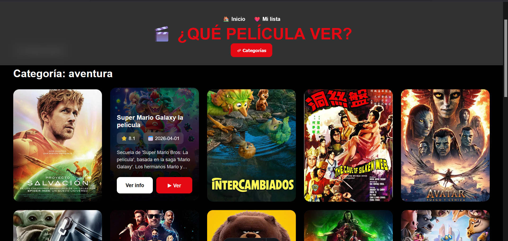
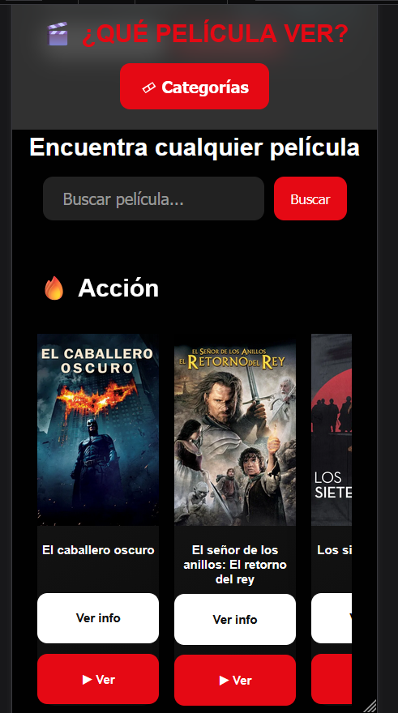
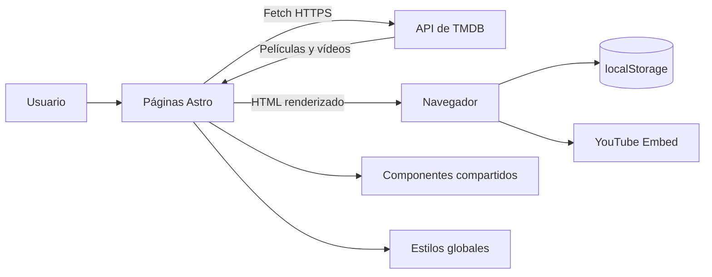
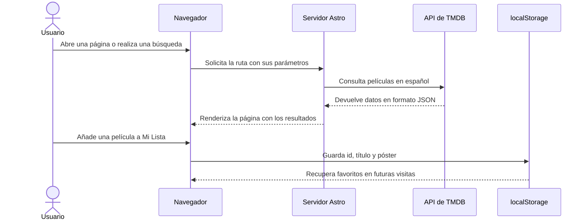

# 🎬 CineApp — ¿Qué Película Ver?

> Aplicación web de descubrimiento de películas inspirada en las plataformas de streaming, desarrollada con Astro y TypeScript sobre la API de The Movie Database (TMDB).


CineApp permite descubrir las películas en tendencia, explorar títulos por género, realizar búsquedas, consultar fichas detalladas y crear una lista personal de favoritos. La información se obtiene en tiempo real desde TMDB y las preferencias del usuario se conservan localmente en su navegador.

El proyecto está orientado al aprendizaje y al portfolio profesional. Su implementación pone en práctica el consumo de una API REST, el renderizado con Astro, la creación de rutas dinámicas, la reutilización de componentes, el tipado con TypeScript y el diseño responsive.

## Demo

La aplicación se encuentra desplegada en Netlify:

### [Abrir CineApp](https://cineapp-jose.netlify.app/)

## Índice

- [Vista de la aplicación](#vista-de-la-aplicación)
- [Funcionalidades](#funcionalidades)
- [Arquitectura](#arquitectura)
- [Flujo de navegación y datos](#flujo-de-navegación-y-datos)
- [Páginas y componentes](#páginas-y-componentes)
- [Decisiones técnicas](#decisiones-técnicas)
- [Tecnologías](#tecnologías)
- [Estructura del proyecto](#estructura-del-proyecto)
- [Ejecución local](#ejecución-local)
- [Despliegue](#despliegue)
- [Qué demuestra este proyecto](#qué-demuestra-este-proyecto)
- [Evolución prevista](#evolución-prevista)
- [Autor y contacto](#-autor-y-contacto)
- [Licencia](#-licencia)

## Vista de la aplicación

### Página principal

La portada reúne el carrusel de tendencias, el buscador y varias selecciones de películas organizadas por género.


### Hero dinámico

El carrusel principal muestra las diez películas con mayor tendencia semanal. Cada diapositiva incluye título, sinopsis, valoración, votos y fecha de estreno, y cambia automáticamente cada seis segundos.


### Categorías

El menú de categorías permite filtrar el catálogo por género. La página de cada categoría consulta TMDB y presenta los resultados con paginación, facilitando la exploración según los intereses del usuario.


### Búsqueda de películas

El buscador consulta películas por palabras clave e informa al usuario cuando intenta enviar una búsqueda vacía. Los resultados muestran el póster y un resumen de cada título, con acceso directo a su ficha.


En este ejemplo, CineApp utiliza la palabra clave «Kill», consulta la API de TMDB y muestra automáticamente las películas relacionadas con el término introducido.

### Información dinámica en las tarjetas

En pantallas grandes, las tarjetas muestran una capa informativa al pasar el cursor. Esta vista incluye el título, la valoración, la fecha, una parte de la sinopsis y accesos a la información o reproducción.



### Ficha detallada

La ficha individual reúne la portada, sinopsis, géneros, duración, valoración y fecha de estreno. Desde ella también se puede abrir el reproductor demostrativo y añadir la película a la lista personal.


### Tráiler oficial

Cuando TMDB proporciona un tráiler de YouTube, CineApp lo integra directamente en la ficha de la película.


### Películas relacionadas

Cada ficha incluye una selección de títulos similares para continuar explorando contenido relacionado.


### Mi Lista

El usuario puede crear una lista personalizada de películas. Los favoritos se guardan en `localStorage`, se muestran en una página propia y se identifican mediante un corazón mientras se navega por la aplicación.


### Diseño responsive

La interfaz se adapta a dispositivos móviles con una disposición optimizada para pantallas pequeñas y controles táctiles. El hero, las tarjetas, el buscador, los detalles y la lista de favoritos mantienen sus funciones en la versión móvil.




## Funcionalidades

### Descubrimiento de contenido

- Carrusel con las diez películas en tendencia de la semana.
- Selecciones de acción, comedia, terror, drama, ciencia ficción y animación.
- Menú global con 19 géneros cinematográficos.
- Catálogo por género con navegación entre páginas.
- Recomendaciones de películas similares desde cada ficha.

### Búsqueda e información

- Búsqueda por palabras clave mediante TMDB.
- Validación básica para impedir búsquedas vacías.
- Tarjetas con información adicional mediante `hover` en escritorio.
- Fichas con sinopsis, géneros, duración, puntuación y estreno.
- Integración del tráiler oficial alojado en YouTube cuando está disponible.
- Modal de reproducción demostrativo con apertura automática mediante `?autoplay=true`.

### Lista personal

- Incorporación de películas a «Mi Lista».
- Persistencia de favoritos mediante `localStorage`.
- Indicador visual en las películas guardadas.
- Eliminación de títulos desde la página de favoritos.
- Mensajes emergentes de confirmación mediante un sistema de `toast`.

### Experiencia de usuario

- Diseño responsive para escritorio y móvil.
- Navegación consistente mediante cabecera y pie compartidos.
- Interfaz visual inspirada en servicios de streaming.
- Controles de retorno, paginación y menús desplegables.

## Arquitectura

CineApp es una aplicación Astro con renderizado en servidor. Las páginas solicitan los datos a TMDB durante cada petición y entregan el HTML resultante al navegador. En el cliente, pequeños scripts TypeScript gestionan las interacciones, el carrusel, los modales y los favoritos.



| Área | Responsabilidad |
|---|---|
| Páginas Astro | Resuelven rutas, leen parámetros y solicitan datos a TMDB. |
| Componentes | Reutilizan la cabecera, el pie y las tarjetas de películas. |
| Layout | Define la estructura HTML común y carga los estilos globales. |
| Scripts de cliente | Gestionan favoritos, validaciones, carrusel, desplegable y modal. |
| `localStorage` | Conserva la lista personal en el dispositivo del usuario. |
| TMDB | Proporciona tendencias, búsquedas, géneros, detalles, vídeos y recomendaciones. |
| Netlify | Ejecuta y publica la aplicación mediante el adaptador oficial de Astro. |

## Flujo de navegación y datos



La aplicación utiliza dos estados claramente diferenciados:

- Los datos del catálogo proceden de TMDB y pueden cambiar con el tiempo.
- Los favoritos pertenecen al navegador actual; no existe una cuenta de usuario ni sincronización entre dispositivos.

## Páginas y componentes

### Rutas

| Ruta | Archivo | Finalidad |
|---|---|---|
| `/` | `src/pages/index.astro` | Portada, tendencias, buscador y selecciones por género. |
| `/busqueda?q=texto` | `src/pages/busqueda.astro` | Resultados de una búsqueda por palabras clave. |
| `/categoria/[genero]?id=...&page=...` | `src/pages/categoria/[genero].astro` | Catálogo paginado de un género de TMDB. |
| `/pelicula/[id]` | `src/pages/pelicula/[id].astro` | Detalle, tráiler, favoritos y películas similares. |
| `/pelicula/[id]?autoplay=true` | `src/pages/pelicula/[id].astro` | Ficha con el modal de reproducción abierto. |
| `/favoritos` | `src/pages/favoritos.astro` | Lista guardada en el navegador y opción de eliminar títulos. |

Las rutas de búsqueda, categoría y detalle desactivan el prerenderizado porque dependen de parámetros dinámicos y de consultas realizadas en el momento de la petición.

### Componentes reutilizables

| Componente | Responsabilidad |
|---|---|
| `MainLayout.astro` | Estructura común, metadatos básicos, cabecera, contenido y pie. |
| `Header.astro` | Logo, navegación principal y menú desplegable de categorías. |
| `Footer.astro` | Información del proyecto y atribución de datos. |
| `HomeMovieCard.astro` | Tarjeta reutilizable con póster, overlay, valoración y accesos. |
| `CategoryCard.astro` | Enlace visual reutilizable para representar una categoría. |

## Decisiones técnicas

### Astro con renderizado en servidor

El proyecto usa `output: "server"` y el adaptador de Netlify. Esto permite resolver rutas dinámicas y consultar TMDB al solicitar cada página, sin necesitar un backend propio para replicar o almacenar el catálogo.

### Configuración de TMDB

La integración actual utiliza la variable `PUBLIC_TMDB_API_KEY`. Su valor no se incluye en el repositorio: `.env` está ignorado y `.env.example` documenta el nombre esperado.

> Como las consultas se ejecutan en el frontmatter de las páginas y la aplicación usa renderizado en servidor, una evolución recomendable sería emplear una variable privada y mantener la credencial exclusivamente en el servidor.

### Favoritos sin registro

La lista se almacena como JSON en `localStorage`. Esta solución evita incorporar autenticación y base de datos en un proyecto centrado en el consumo de APIs, aunque limita la persistencia al navegador y dispositivo actuales.

### Componentes para evitar duplicación

El layout y las tarjetas compartidas concentran la estructura común. Las páginas dinámicas reutilizan estas piezas y mantienen su responsabilidad principal: obtener y presentar los datos de cada ruta.

### Interactividad con JavaScript reducido

Astro entrega HTML renderizado y solo incorpora scripts para los comportamientos que lo necesitan. El proyecto no mantiene un estado global ni descarga un framework completo de interfaz.

### Contenido localizado

Las consultas principales incluyen `language=es-ES`, por lo que títulos, descripciones y metadatos se solicitan en español cuando TMDB dispone de traducción.

## Tecnologías

| Área | Tecnología | Uso |
|---|---|---|
| Framework | Astro 6.4.2 | Rutas, componentes y renderizado en servidor. |
| Lenguaje | TypeScript | Tipado de datos de TMDB y scripts del navegador. |
| Interfaz | HTML5 y CSS3 | Estructura, animaciones y diseño responsive. |
| Datos | TMDB API | Catálogo, tendencias, búsquedas, vídeos y recomendaciones. |
| Persistencia local | Web Storage API | Gestión de la lista de favoritos. |
| Contenido multimedia | YouTube Embed | Reproducción de los tráileres disponibles. |
| Adaptador | `@astrojs/netlify` | Ejecución de Astro en Netlify. |
| Entorno | Node.js 22.12 o superior | Desarrollo, build y ejecución del proyecto. |
| Gestor de paquetes | npm | Instalación de dependencias y scripts. |

## Estructura del proyecto

```text
.
├── !Informacion/
│   └── inciarWebApi.txt
├── imagenes/                 # Capturas utilizadas en este README
├── public/                   # Recursos públicos y favicon
├── src/
│   ├── assets/
│   ├── components/
│   │   ├── CategoryCard.astro
│   │   ├── Footer.astro
│   │   ├── Header.astro
│   │   └── HomeMovieCard.astro
│   ├── layouts/
│   │   └── MainLayout.astro
│   ├── pages/
│   │   ├── categoria/
│   │   │   └── [genero].astro
│   │   ├── pelicula/
│   │   │   └── [id].astro
│   │   ├── busqueda.astro
│   │   ├── favoritos.astro
│   │   └── index.astro
│   └── styles/
│       └── global.css
├── .env.example
├── astro.config.mjs
├── package.json
└── tsconfig.json
```

## Ejecución local

### Requisitos

- Node.js 22.12 o una versión posterior.
- npm.
- Una cuenta de [TMDB](https://www.themoviedb.org/) con una API Key.

### 1. Clonar el repositorio

```bash
git clone https://github.com/megalol-dev/cineapp.git
cd cineapp
```

### 2. Instalar las dependencias

```bash
npm install
```

### 3. Configurar TMDB

Crea un archivo `.env` en la raíz. Puedes copiar `.env.example` y sustituir el valor de ejemplo por tu clave:

```env
PUBLIC_TMDB_API_KEY="TU_API_KEY"
```

No publiques este archivo ni una clave real en Git.

### 4. Iniciar el servidor de desarrollo

```bash
npm run dev
```

La aplicación estará disponible en:

```text
http://localhost:4321
```

### Scripts disponibles

| Comando | Finalidad |
|---|---|
| `npm run dev` | Inicia el servidor de desarrollo de Astro. |
| `npm run build` | Genera y valida la compilación de producción. |
| `npm run preview` | Previsualiza localmente la compilación. |
| `npm run astro -- <comando>` | Ejecuta directamente la CLI de Astro. |

## Despliegue

El proyecto incluye `@astrojs/netlify` y está configurado para generar una aplicación con renderizado en servidor:

```js
export default defineConfig({
  output: "server",
  adapter: netlify(),
});
```

Para desplegar una copia es necesario definir `PUBLIC_TMDB_API_KEY` en las variables de entorno del proveedor antes de ejecutar `npm run build`.

## Qué demuestra este proyecto

- Consumo y transformación de datos procedentes de una API REST real.
- Creación de páginas estáticas y dinámicas con Astro.
- Uso de parámetros de ruta y parámetros de consulta.
- Componentización de una interfaz y reutilización de layouts.
- Tipado de respuestas externas con interfaces TypeScript.
- Persistencia de preferencias en el navegador.
- Implementación de carruseles, modales, overlays y notificaciones.
- Diseño responsive orientado a escritorio y móvil.
- Configuración de un proyecto para despliegue con renderizado en servidor.
- Organización y documentación de un proyecto de portfolio.

## Evolución prevista

- Centralizar las llamadas a TMDB en un módulo de servicio reutilizable.
- Incorporar estados de carga y tratamiento uniforme de errores de red o de la API.
- Añadir imágenes alternativas cuando una película no tenga póster o fondo.
- Validar los parámetros de género, página e identificador antes de consultar TMDB.
- Mejorar la accesibilidad del menú, los modales y la navegación mediante teclado.
- Añadir pruebas unitarias, de integración y end-to-end.
- Sincronizar favoritos entre dispositivos mediante cuentas de usuario y persistencia remota.
- Incorporar filtros adicionales por año, idioma, popularidad o valoración.
- Mejorar los metadatos SEO y los títulos específicos de cada página.

# 📫 Autor y Contacto

**José Luis Escudero Polo**

Desarrollador Junior Full Stack (DAW)

📧 Email: **escuderopolojoseluis@gmail.com**

🌐 Portfolio: https://megalol-dev.github.io/

💼 LinkedIn: https://linkedin.com/in/jose-luis-escudero-polo

📺 YouTube: https://youtu.be/_rlHMVV9Ap4?si=ltRKd2t1Wjuxx6Ai

---

## 📜 Licencia

Proyecto desarrollado con fines de portfolio. Proyecto privado sin autorización para el comercio.
